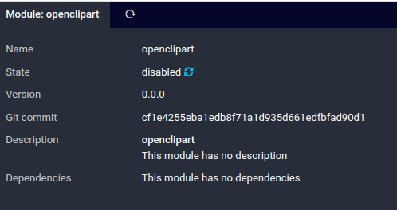

# Openclipart Module Installation <a id="openclipart-module-installation"></a>

Go to the Icinga Web 2 module directory

```
cd /usr/share/icingaweb2/modules/
```

Download the module

```
git clone https://git.netways.de/ausbildung/azubis-2022/icingaweb2-module-openclipart.git openclipart
```

You can check if the module is installed correctly with

```
icingacli module list installed
```

The openclipart module should be listed and disabled.

## Enable the Module <a id="openclipart-module-enable"></a>

In the web navigate to `Configuration` -> `Modules` -> `openclipart` and enable the module by clicking on the spinning arrows.



You can also enable the module on the CLI
```
icingacli module enable openclipart
```