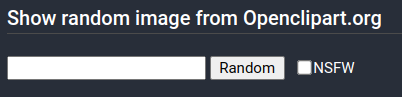
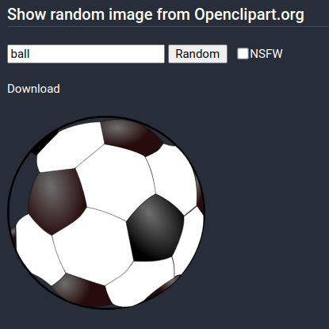
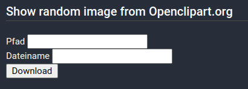
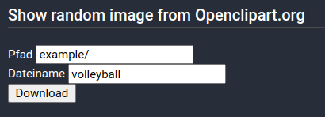
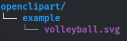

# Introduction <a id="module-openclipart-introduction"></a>

This module allows to query random images for entered search terms. It also allows  
to download those images and use them as icons in other Icinga Web 2 modules.

## Search for random images <a id="module-openclipart-search"></a>

Open the `Random Image`-Chapter 


In the following you see the form to search for random images.  
You can search for terms and filter if you want to see nsfw content or not.



After the search the image and a link to download will appear. The link will take you  
to the download form.



## Download images <a id="module-openclipart-download"></a>

Following you see the form to download the image.  
The first field is the path relative to  
`/usr/share/icingaweb2/modules/openclipart/public/img/openclipart/`.  
The second one is for the filename. `.svg` extension is appended automatically.



Here is an example how to fill the fields.



The example is stored as follows.



## Use images as icons <a id="module-openclipart-icons"></a>

After the images is downloaded you can use it as an icon for sections and section subpoints.

First you have to open the module configuration. (In this case vim is used as editor, but you can use whatever you prefer)

```
vim /usr/share/icingaweb2/modules/[MODULE_DIR]/configuration.php
```

Then you can add a new subpoint to the section. The example shows how to change the icon for the Openclipart module.

```
$section = $this->menuSection('Openclipart');
$section->setIcon('img/openclipart/scissors.png');
```